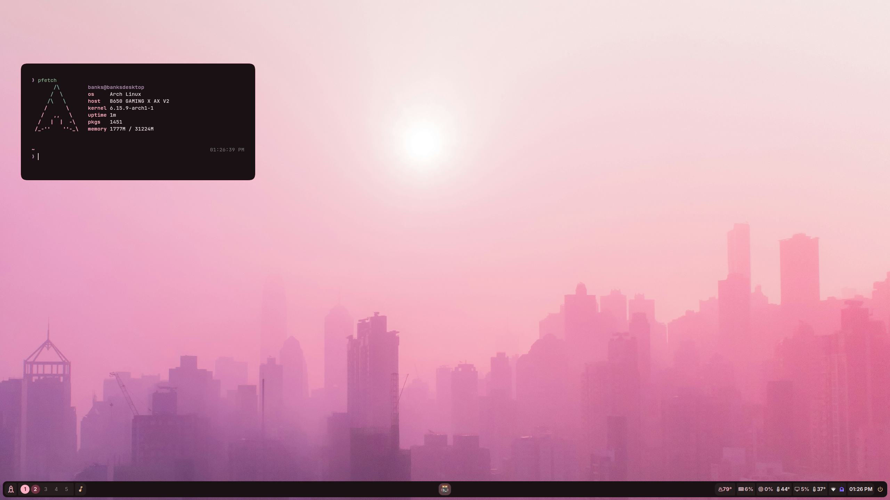
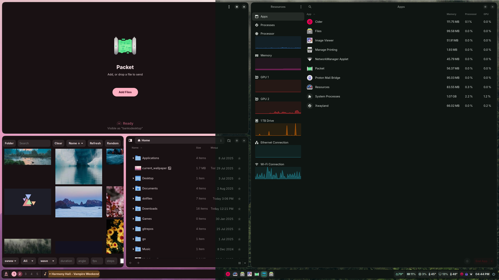
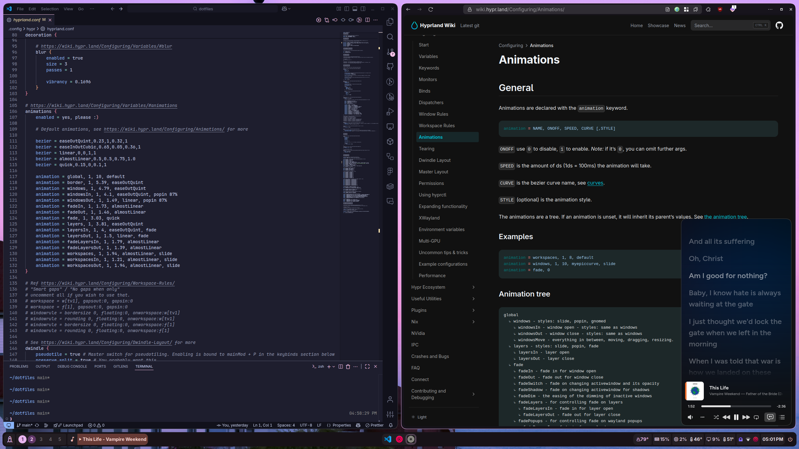
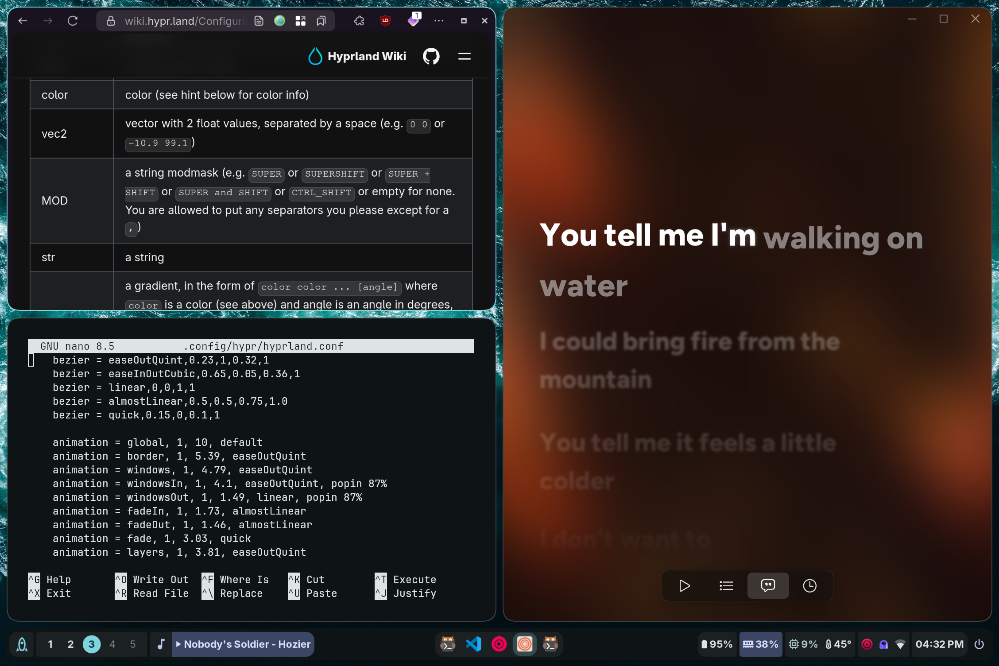

# Aster's Hyprland Dotfiles

<b>Desktop Config</b>

  
  
  

<b>Laptop Config</b>

  
  
  

---

<b>This repo contains my (loosely) Material Design-based Hyprland config, for both desktop and laptop.</b>

## Tools
| Thing            | App/Program used                                  |
|------------------|---------------------------------------------------|
| Shell            | Zsh / P10k (https://github.com/romkatv/zsh4humans)|
| Terminal         | Kitty                                             |
| DE / WM          | Hyprland                                          |
| Color generation | Matugen                                           |
| Wallpapers       | swww & Unsplash                                   |
| Status bar       | Waybar                                            |
| Launcher         | Rofi                                              |
| File Manager     | Nautilus / GNOME-Files                            |
| Notifications    | Swaync                                            |
| Lock / Idle      | Hyprlock & Hypridle                               |
| Icons            | Papirus (apps & GTK) & Nerd Fonts (everything else)|
| Fonts            | Adwaita Sans, Product Sans, JetBrains Mono NF     |
| Browser          | Zen                                               |
| Music Player     | Cider                                             |

## Keybinds
| Bind | Action |
|------|--------|
|Super + Space | Open Launcher (Rofi) |
|Super + T | Open Terminal (kitty) |
|Super + Q | Close active window |
|Super + E | Open Nautilus |
|Super + Alt + Space | Toggle floating |
|Super + V | Show clipboard history |
|Super + J | Switch split direction |
|Super + Ctrl + S | Take screenshot |
|Super + F | Toggle fullscreen |
|Super + [0-9] | Go to workspace # |
|Super + Shift + [0-9] | Move window to workspace # |
|Super + S | Summon scratchpad |
|Super + Shift + S | Move window to scratchpad |

## Installation
See [Installation](https://github.com/bmalia/dotfiles/blob/main/INSTALLATION.md)

