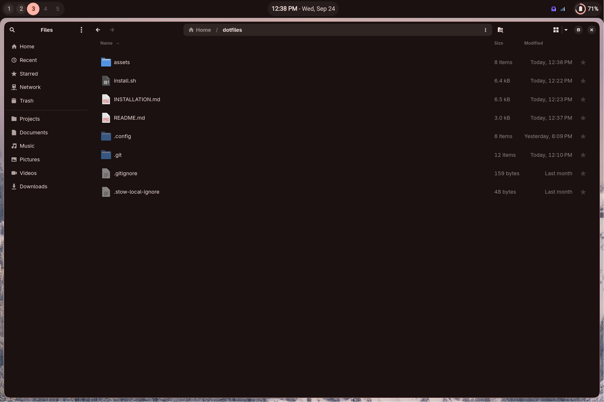

# Hyprland Dotfiles

**This repo contains a collection of my Hyprland configurations**

## Active Versions

<b>Yosemite-Shell</b>quickshell

  
  
  

**A minimal, material design-based shell for Hyprland**

### Features

- Sleek, minimal status bar
- Dynamic color generation from your wallpaper
- Preconfigured keybinds and touchpad gestures
- Light and dark mode
- Expressive animations

### Planned

- [x] Easy, consolidated configuration
- [ ] Multiple bar styles and setups
- [ ] Control & notification center
- [ ] Expandable media player

## Utilities

| Thing                        | App/Program used                                    |
| ---------------------------- | --------------------------------------------------- |
| Shell                        | Zsh / P10k (https://github.com/romkatv/zsh4humans)  |
| Terminal                     | Kitty                                               |
| DE / WM                      | Hyprland                                            |
| Color generation             | Matugen                                             |
| Wallpapers                   | swww (Pictures from Unsplash)                       |
| Status bar / Graphical Shell | Quickshell                                          |
| Launcher                     | Vicinae                                             |
| File Manager                 | Nautilus / GNOME-Files                              |
| Notifications                | SwayNC                                              |
| Lock / Idle                  | Hyprlock & Hypridle                                 |
| Icons                        | Papirus (apps & GTK) & Nerd Fonts (everything else) |
| Fonts:                       |                                                     |
| - Text                       | Roboto & Adwaita Sans                               |
| - Display                    | Product Sans                                        |
| - Monospace                  | JetBrains Mono Nerd Font                            |
| Browser                      | Zen (Not installed by config)                       |
| Music Player                 | Cider (Not installed by config)                     |

## Keybinds

| Bind                  | Action                     |
| --------------------- | -------------------------- |
| Super + Space         | Open Launcher (Vicinae)    |
| Super + T             | Open Terminal (kitty)      |
| Super + Q             | Close active window        |
| Super + E             | Open Nautilus              |
| Super + Alt + Space   | Toggle floating            |
| Super + V             | Show clipboard history     |
| Super + J             | Switch split direction     |
| Super + Ctrl + S      | Take screenshot            |
| Super + F             | Toggle fullscreen          |
| Super + [0-9]         | Go to workspace #          |
| Super + Shift + [0-9] | Move window to workspace # |
| Super + S             | Summon scratchpad          |
| Super + Shift + S     | Move window to scratchpad  |

## Old versions

*The waybar versions here are no longer maintained by me. Bugs will go unfixed and no new features will be added.* \
*They are still hosted on branches `old-desktop` and `old-laptop` respectively.*

<b>Pixel-Desktop</b>waybar

  
  
  

<b>Pixel-Laptop</b>waybar

  
  
  

## Installation

See [Installation](https://github.com/bmalia/dotfiles/blob/main/INSTALLATION.md)
